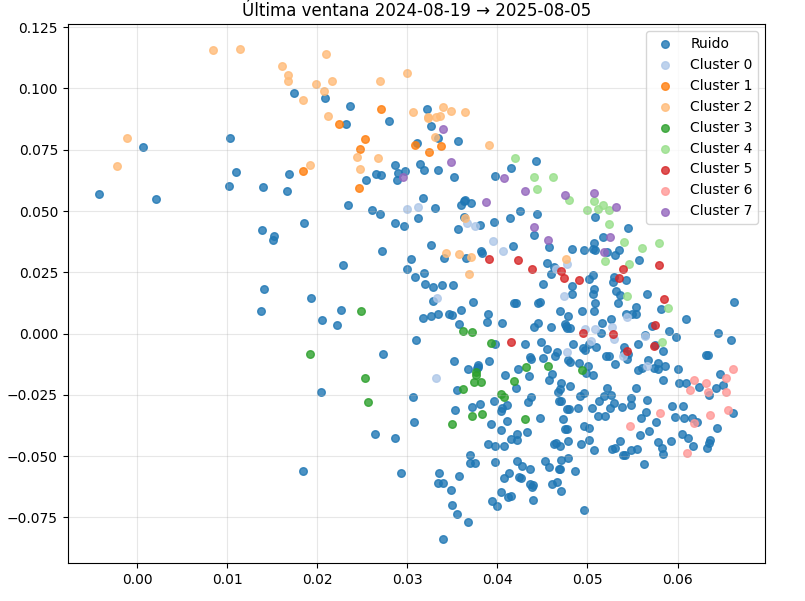
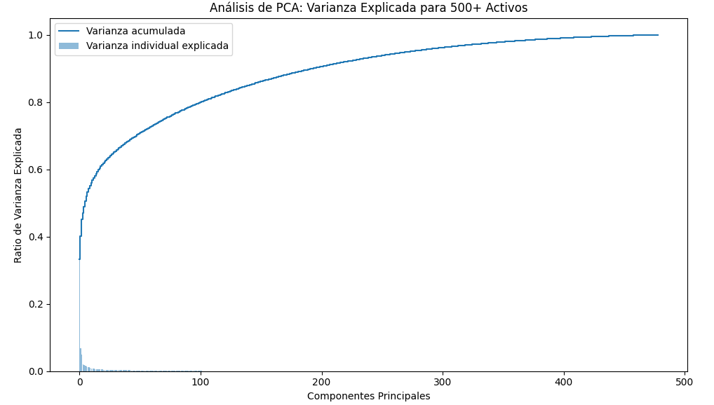

# Quantitative Trading Research: PCA + DBSCAN Clustering

This project develops a quantitative framework to identify statistically related equities and construct potential statistical arbitrage opportunities using unsupervised learning and time-series analysis.

## 📊 Key Research Visualizations

### 1. Dimensionality Reduction (PCA)

* **Process**: Used **Principal Component Analysis (PCA)** to reduce the dimensionality of 500+ equities, filtering out idiosyncratic noise.
* **Impact**: This step ensures that the subsequent clustering is based on structural risk factors rather than market volatility.

### 2. Asset Selection via DBSCAN Clustering

* **Methodology**: Applied **DBSCAN** on the principal components to identify natural groupings of assets without sector bias.
* **Results**: Achieved stable cluster structures across rolling windows with a **silhouette score of up to 0.42**.

### 3. Statistical Arbitrage Signal (Spread)

* **Strategy**: Within each cluster, I identified statistically cointegrated pairs to generate mean-reversion signals.
* **Signal**: The spread analysis calculates the **half-life of mean reversion**, allowing for precise entry and exit points in a pairs trading strategy.

---

## 🛠️ Skills & Tools
* **Technical Stack**: Python (Pandas, Scikit-Learn, Statsmodels), MATLAB.
* **Quantitative Methods**: Time-series analysis, cointegration tests, and unsupervised machine learning.
* **Academic Background**: Double degree student in Finance and International Business at Universidad EAFIT.

---

