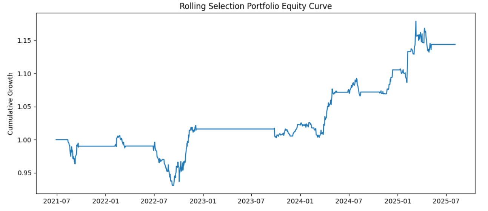
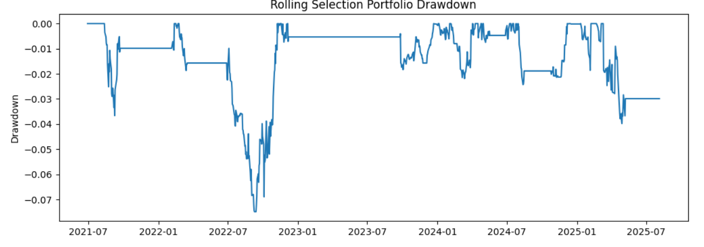

# Multi-Signal Equity Strategy: Clustering, Cointegration & Rolling Selection

## Overview

This project develops a systematic equity strategy for statistical arbitrage using clustering-based asset selection, cointegration analysis, and rolling out-of-sample pair selection.

The objective is to identify structurally similar equities, construct mean-reverting spreads, and evaluate whether a subset of selected pairs can generate robust risk-adjusted returns over time.

---

## Research Question

Can clustering and cointegration be combined to identify equity pairs that generate stable mean-reversion signals, and does performance survive under rolling out-of-sample selection?

---

## Methodology

### 1. Asset Universe Filtering
- Universe of 500+ equities
- Data preprocessing and alignment
- Feature extraction for dimensionality reduction

### 2. Clustering-Based Asset Selection
- Applied PCA to reduce dimensionality and isolate structural variation
- Used DBSCAN to identify groups of similar equities
- Achieved stable clustering across rolling windows, with silhouette score up to **0.42**

### 3. Pair Formation
- Selected candidate pairs from clustered assets
- Tested for statistical relationships using cointegration-based logic
- Modeled spreads using log-price relationships
- Estimated half-life of mean reversion to control trade duration

### 4. Signal Construction
- Generated long/short signals using spread z-scores
- Used threshold-based entry and exit rules
- Included transaction costs in backtesting

### 5. Pair-Level Diagnosis
Initial aggregate backtests showed weak overall performance.  
Pair-level analysis revealed that:
- alpha was concentrated in a subset of pairs
- some pairs added noise
- some pairs materially destroyed performance

This led to a refined pair selection framework.

### 6. Rolling Selection Framework
To reduce look-ahead bias and test robustness:
- pairs were ranked using a historical lookback window
- top-performing pairs were selected dynamically
- selected pairs were traded in the following out-of-sample period
- the process was repeated through time

---

## Results

### In-Sample Filtered Strategy
- Sharpe Ratio: **~0.76**
- Cumulative Return: **~20%**
- Annualized Return: **~4.3%**

### Rolling Out-of-Sample Strategy
- Sharpe Ratio: **~0.69**
- Annualized Return: **~3.3%**
- Annualized Volatility: **~4.8%**
- Max Drawdown: **~7.5%**
- Cumulative Return: **~14%**

These results suggest that performance is not driven purely by overfitting, and that a subset of stable pairs retains predictive structure out-of-sample.
---
## Strategy Performance

### Equity Curve (Rolling Out-of-Sample)

### Drawdown (Rolling Out-of-Sample)

---

## Key Insights

- Cointegration alone is not enough to generate alpha
- Performance is concentrated in a subset of stable pairs
- Pair selection matters more than model complexity
- Out-of-sample rolling validation is critical in systematic strategies

---

## Repository Contents

- `README.md` — project overview and results
- notebooks / scripts — clustering, pair formation, backtesting and rolling selection
- figures — PCA, clustering, spread behavior, and performance visualizations

---

## Future Extensions

- Include sentiment as an alternative-data filter
- Explore dynamic weighting across active pairs
- Test broader universes and sector-neutral constraints

---

## Author

Felipe Cossio Vanegas

